<div align="center">

# 🛒 Enterprise AI Commerce Intelligence Platform

### Next-Generation AI-Native Microservices Ecosystem

### Recommendations • RAG • Multi-Agent AI • Forecasting • Analytics • Visual Search • Distributed Microservices


</div>

---

# 📌 Project Overview

**Enterprise AI Commerce Intelligence Platform** is a full-stack, distributed microservices e-commerce ecosystem integrating Artificial Intelligence, Machine Learning, Data Engineering, Retrieval-Augmented Generation (RAG), Agentic AI, Demand Forecasting, Dynamic Pricing, Fraud Detection, and Data Warehousing.

---

"I engineered a polyglot microservices cluster that handles high-concurrency traffic spikes using a lock-free Redis data allocator, protects cloud budgets via token-based rate limiting, and guarantees eventual consistency during network partitions via an automated Saga Orchestrator verified by Jepsen-style chaos testing."

---

# 🚧 Platform Implementation Status

| Component | Status | Details |
| :--- | :---: | :--- |
| **Storefront & Admin Dashboards** | ✅ Completed | Next.js 14 React client apps with API Gateway proxying |
| **API Gateway** | ✅ Completed | Port 8000 central proxy, auth verification, and rate limiting |
| **Core Microservices (10 Services)** | ✅ Completed | Auth, User, Product, Inventory, Cart, Order, Payment, Shipping, Coupon, Review |
| **Python AI Microservices (7 Services)** | ✅ Completed | RAG Support, Demand Forecast, Dynamic Pricing, Fraud Detection, Visual Search, Recommendation ML, Agentic AI |
| **Data Warehouse & ETL Pipeline** | ✅ Completed | MongoDB-to-MySQL CDC pipelines & automated daily ETL scheduler |
| **Event Streaming (Kafka)** | ✅ Completed | Kafka event producer in `auth-service` with graceful fallback |
| **Docker Orchestration** | ✅ Completed | Master `docker-compose.yml` for all 17 microservices + DBs |

---

# 🏗️ High-Level System Architecture

The platform is structured into a multi-tier, event-driven microservices ecosystem. It decouples core e-commerce transactional workloads from heavy AI/ML inference and analytical data processing.

```mermaid
flowchart TD
    subgraph Client_Layer ["Client Presentation Layer"]
        SF["Storefront Client (Next.js 14)"]
        AD["Admin Dashboard (Next.js 14)"]
    end

    subgraph Edge_Layer ["Edge & Routing Layer"]
        GW["API Gateway (Express Proxy - Port 8000)"]
        GW -->|Auth Middleware & Rate Limiter| AuthVal["Token Verification"]
    end

    SF -->|REST / HTTPS| GW
    AD -->|REST / HTTPS| GW

    subgraph Core_Services ["Core Domain Microservices (Node.js / Express)"]
        AuthSvc["Auth Service (Port 3001)"]
        UserSvc["User Service (Port 3002)"]
        ProdSvc["Product Service (Port 3003)"]
        InvSvc["Inventory Service (Port 3004)"]
        CartSvc["Cart Service (Port 3005)"]
        OrderSvc["Order Service (Port 3006)"]
        PaySvc["Payment Service (Port 3007)"]
        ShipSvc["Shipping Service (Port 3008)"]
        CpnSvc["Coupon Service (Port 3009)"]
        RevSvc["Review Service (Port 3010)"]
    end

    GW --> AuthSvc & UserSvc & ProdSvc & InvSvc & CartSvc & OrderSvc & PaySvc & ShipSvc & CpnSvc & RevSvc

    subgraph AI_Services ["AI & Intelligence Microservices (Python / FastAPI)"]
        RAGSvc["RAG Support Service (Port 8001)"]
        FcstSvc["Demand Forecast Service (Port 8002)"]
        PrcSvc["Dynamic Pricing Service (Port 8003)"]
        FrdSvc["Fraud Detection Service (Port 8004)"]
        VisSvc["Visual Search Service (Port 8005)"]
        MLSvc["ML Recommendation Service (Port 8006)"]
        AgtSvc["Agentic AI Operations Service (Port 8007)"]
    end

    GW --> RAGSvc & FcstSvc & PrcSvc & FrdSvc & VisSvc & MLSvc & AgtSvc

    subgraph Infrastructure_Layer ["Persistence & Infrastructure Layer"]
        MongoDB[(MongoDB Database Cluster)]
        MySQL[(MySQL Data Warehouse)]
        Kafka[[Kafka Event Stream]]
        Redis[(Redis Cache)]
    end

    AuthSvc & UserSvc & ProdSvc & InvSvc & CartSvc & OrderSvc & PaySvc & ShipSvc & CpnSvc & RevSvc -->|Mongoose ODMs| MongoDB
    AuthSvc -->|Publish User Events| Kafka
    OrderSvc -->|Publish Order Events| Kafka

    subgraph Data_Pipeline ["Data Pipeline & ETL Layer"]
        ETL["Python Ingestion Engine (etl_products, etl_orders, etl_events)"]
        MongoDB -->|Extract Document CDC| ETL
        ETL -->|Transform & Load| MySQL
        Scheduler["Daily Job Scheduler"] -->|Trigger Stored Procedures| MySQL
    end
```



### 🏛️ Layer Breakdown

1. **Presentation & Client Layer (`apps/`)**:
   - `storefront`: React/Next.js 14 customer-facing shopping application.
   - `admin-dashboard`: Merchant management control panel for inventory, fulfillment, dynamic pricing, and AI agent monitoring.

2. **Edge Proxy & API Gateway (`services/api-gateway`)**:
   - Single point of entry running on **Port 8000**.
   - Handles path routing, cross-origin CORS policies, security headers (Helmet), and proxies authentication header validation (`x-user-id`, `x-user-email`) down to internal microservices.

3. **Core Domain Layer (`services/cors/`)**:
   - Decoupled Express microservices handling domain transactional logic.
   - Each microservice possesses its own isolated MongoDB database instance (Database-per-Service pattern).

4. **Intelligence & AI Layer (`services/intelligence/` & `services/operations/`)**:
   - High-performance FastAPI Python microservices.
   - Implements specialized ML models (Prophet/LSTM for forecasting, CLIP embeddings + FAISS/Qdrant for visual search, vector RAG for customer support, and multi-agent execution graphs via LangChain/LangGraph).

5. **Analytics & Data Pipeline Layer (`services/data-pipeline/`)**:
   - Extracts transactional state changes from MongoDB, transforms raw JSON into normalized relational schemas (`dim_products`, `dim_customers`, `fact_orders`), and loads into a MySQL OLAP warehouse for business intelligence querying.

---

# 🤖 AI & Intelligence Ecosystem

1. **RAG Support Pipeline (`rag-service` - Port 8001)**: Retrieval-augmented product question answering and knowledge base search.
2. **Demand Forecasting (`forecast-service` - Port 8002)**: Time-series forecasting for SKU inventory optimization (Prophet / LSTM models).
3. **Dynamic Pricing Engine (`pricing-service` - Port 8003)**: Dynamic price optimization based on inventory depth, market demand, and competitor pricing.
4. **Real-time Fraud Detection (`fraud-service` - Port 8004)**: Real-time risk scoring (0-100 score, risk level tiers, anomaly flagging).
5. **Visual Product Search (`visual-search-service` - Port 8005)**: Image upload vector embedding matching using CLIP & similarity search.
6. **Machine Learning Recommendations (`ml-service` - Port 8006)**: Collaborative & content-based product recommendation API.
7. **Agentic AI Operations (`agent-service` - Port 8007)**: LangChain / LangGraph multi-agent execution workflows for inventory, pricing, marketing, and support.

---

# ⚡ Advanced Architectural & Resilience Features

### 1. Algorithmic Lock-Free In-Memory Inventory Allocator (Redis Lua Scripts)
- **The Challenge**: Traditional relational databases block during flash sales (limited-edition drops, smartphone releases) when hundreds of thousands of users attempt to purchase items at the exact same millisecond. Relational row-level locks exhaust connection pools, freeze execution threads, and crash the system.
- **The Solution**: We implemented an **Algorithmic Lock-Free In-Memory Inventory Allocator** in `inventory-service` using a single-threaded **Redis Lua Script** (`reserveStockLua`).
- **How It Works**: 
  - Stock allocation checks and reserves are executed inside Redis entirely in-memory in `<1ms` without ever touching a disk.
  - The script executes atomically in a single execution thread, eliminating transaction race conditions and double-selling.
  - **Write-Behind Pattern**: Once Redis confirms allocation, the service returns a successful HTTP response to the client immediately and persists the database update to MongoDB asynchronously in a non-blocking background queue, shielding databases from traffic spikes.
- **Run the Concurrency Test**:
  ```bash
  node scripts/test_redis_lua_allocator.js
  ```

### 2. Distributed Saga Orchestrator & Eventual Consistency
- Tracks multi-step checkout transactions (`order-service` ➔ `inventory-service` ➔ `payment-service`).
- Employs compensating transactions (reversing reservations) during downstream failures (e.g. card declines).
- Uses a background **Eventual Consistency Worker** to periodically retry failed compensations (like restocking) if network partitions disrupt the immediate rollback phase.

### 3. OpenTelemetry-Compatible Distributed Tracing
- Integrates standard W3C `traceparent` context passing across Node.js services and Python FastAPI servers.
- Builds a Directed Acyclic Graph (DAG) of request flows, profiling span durations to audit P99 bottlenecks.
- **Run Latency Audit**:
  ```bash
  node scripts/trace_p99_latency_audit.js
  ```

### 4. Token-Aware API Gateway Rate Limiter (Cloud Cost Protection)
- **The Challenge**: Recursive loops in autonomous AI agents or malicious spamming of chatbot interfaces can consume millions of LLM tokens (OpenAI/Anthropic) in minutes, leading to massive cloud bill spikes.
- **The Solution**: We built a custom **Token-Aware Rate Limiter** directly inside the API Gateway (`tokenRateLimiter.js`).
- **How It Works**:
  - Instead of simply checking raw HTTP hits, the middleware inspects incoming JSON payloads (prompts/queries) and calculates the exact input token count.
  - Intercepts visual search requests to add specialized vision token weights (`512` tokens per image).
  - Overrides response payloads to capture and log the generated output tokens.
  - Exceeding the cumulative budget (default `20,000` tokens/min) immediately rejects the request with `429 Too Many Requests` to protect cloud budgets.
- **Run the Cost Protection Test**:
  ```bash
  node scripts/test_token_rate_limiter.js
  ```

### 5. AI Guardrails: Multi-Agent Supervisor Router (agent-service)
- **The Challenge**: Autonomous AI multi-agent workflows (such as LangGraph passing messages between Pricing, Marketing, and Inventory agents) can easily enter cyclic reasoning infinite loops when faced with ambiguous user queries, incurring massive token costs and freezing storefront UX.
- **The Solution**: We integrated an in-memory/Redis-backed **Supervisor Router** (`supervisor.py`) directly into the agent step-traversal chain.
- **How It Works**:
  - Intercepts agent node transitions to verify execution depth limits (capped at a max of `5` loops), raising `422 Unprocessable Entity` if exceeded to fall back to heuristic searches.
  - Tracks cumulative token usage per session and blocks requests if total API spend exceeds `$0.05`, throwing `402 Payment Required` to prevent token financial leakage.
- **Run the Supervisor Test**:
  ```bash
  node scripts/test_agent_supervisor.js
  ```

### 6. Vector Sync: Event-Driven Kafka Change Data Capture (CDC)
- **The Challenge**: Pricing, inventory levels, and discounts mutate rapidly in database layers. Without real-time updates, RAG search engines (e.g. Qdrant/FAISS) query outdated metadata and hallucinate obsolete coupon offers or out-of-stock items.
- **The Solution**: Developed a real-time **Kafka Change Data Capture (CDC) Sync Worker** (`kafka_cdc_worker.py`) in `rag-service`.
- **How It Works**:
  - Subscribes to transaction mutations streamed over a Kafka event bus topic (`product-mutations`).
  - Performs sub-second payload metadata upserts to synchronize vector endpoints directly, guaranteeing RAG queries always reference live catalog state.
- **Run the CDC Sync Test**:
  ```bash
  node scripts/test_vector_sync_cdc.js
  ```

---

# 📚 Technical & Architecture Documentation

For detailed architectural specifications, database schemas, security models, and CI/CD pipelines, explore the system documentation:

| Document | Description | Path Link |
| :--- | :--- | :--- |
| **System Architecture & Design** | High-level system design, decoupled service layers, and core data flows | [`docs/system-design.md`](docs/system-design.md) |
| **Directory & Folder Structure** | Repository layout, service organization, and sub-project blueprints | [`docs/folder-structure.md`](docs/folder-structure.md) |
| **Database Design & Schemas** | MongoDB document models, MySQL Data Warehouse ERDs, and indexing strategy | [`docs/database-design.md`](docs/database-design.md) |
| **Data & AI Layer Architecture** | RAG pipelines, vector search, demand forecasting models, and LLM integration | [`docs/data-and-ai-layer.md`](docs/data-and-ai-layer.md) |
| **API Specifications** | Gateway endpoints, microservice routing maps, and request/response contracts | [`docs/api-spec.md`](docs/api-spec.md) |
| **Sequence Diagrams** | End-to-end transaction flows, Sagas, auth verification, and event streaming | [`docs/sequence-diagrams.md`](docs/sequence-diagrams.md) |
| **System Resilience & Sagas** | Lock-free inventory allocators, Saga orchestrators, rate limiters, and fault tolerance | [`docs/resilience.md`](docs/resilience.md) |
| **Security Architecture** | JWT auth, microservice token validation, CORS policies, and rate-limiting guardrails | [`docs/security.md`](docs/security.md) |
| **Observability & Tracing** | OpenTelemetry W3C distributed tracing, DAG latency audits, and log aggregation | [`docs/observability.md`](docs/observability.md) |
| **Testing & CI/CD Pipelines** | Multi-tier testing, Pact contract verification, and GitHub Actions matrix workflows | [`docs/testing-and-cicd.md`](docs/testing-and-cicd.md) |
| **Backup & Disaster Recovery** | Database snapshot strategies, point-in-time recovery, and failover protocols | [`docs/backup-and-disaster-recovery.md`](docs/backup-and-disaster-recovery.md) |
| **Software Requirements Spec (SRS)** | System requirements, functional/non-functional specs, and system boundaries | [`docs/SRS.md`](docs/SRS.md) |

---

# 🚀 Quick Start & Local Execution

### Method 1: Master Docker Compose (Recommended)

```bash
# Clone repository
git clone https://github.com/Himanshu0523/Enterprise-AI-Commerce-Intelligence-Platform.git
cd Enterprise-AI-Commerce-Intelligence-Platform

# Spin up all 17 microservices + DBs in Docker
docker compose up -d
```

### Method 2: Manual Development Launch

1. **Node Core Microservices**:
   ```bash
   cd services/cors/auth-service
   npm install && npm run dev
   ```

2. **Python AI Microservices**:
   ```bash
   cd services/operations/rag-service
   pip install -r requirements.txt
   python main.py
   ```

3. **Database Seeding**:
   ```bash
   node scripts/seed_database.js
   ```

---

# 📄 License

MIT License | Copyright (c) 2026 Himanshu Satpute
