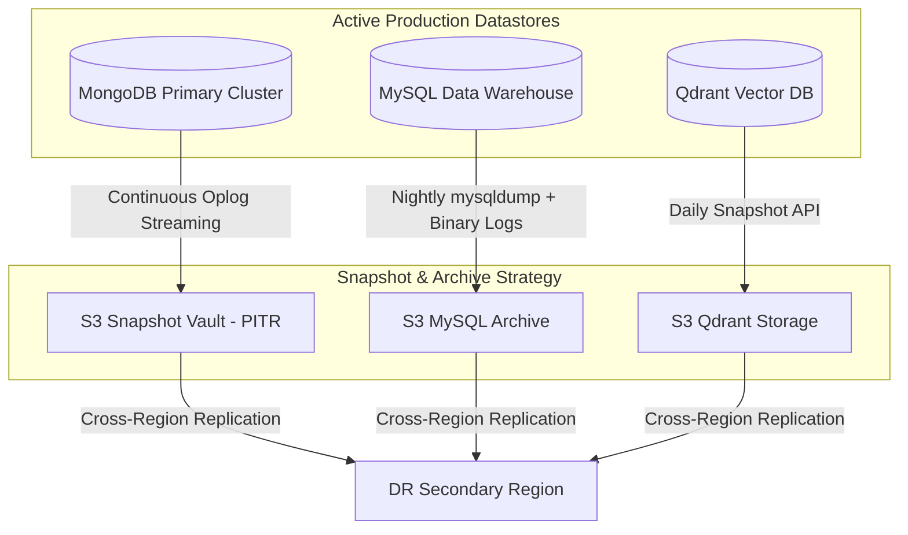

# 💾 Backup, Disaster Recovery (DR), & Business Continuity Plan

## Overview
This document outlines the backup frequencies, Point-in-Time Recovery (PITR) procedures, and Disaster Recovery target metrics (RPO & RTO) across MongoDB, MySQL Data Warehouse, and Qdrant Vector DB.

> **📌 Architecture Note:** The backup strategies described in this document represent the **target production architecture** for cloud deployment (AWS/GCP). For local development, `docker-compose.yml` uses volume mounts for data persistence. The S3, KMS, and cross-region configurations documented below are implementation blueprints for staging/production environments.

---

## 1. Target Recovery Objectives

| Metric | Target Standard | Description |
| :--- | :---: | :--- |
| **RPO (Recovery Point Objective)** | **< 15 Minutes** | Maximum acceptable data loss during catastrophic infrastructure failure. |
| **RTO (Recovery Time Objective)** | **< 1 Hour** | Maximum acceptable downtime before full system restoration. |

---

## 2. Database Backup Schedule & Retention Matrix

### Snapshot Specifications:

1. **MongoDB Operational Database**:
   - **Continuous Oplog Capture**: Point-in-Time Recovery (PITR) enabling granular restore to any second within the past 35 days.
   - **Hourly Snapshots**: Stored in AWS S3 with KMS server-side encryption.
   - **Retention**: 30 Daily Snapshots, 12 Monthly Archives.

2. **MySQL Data Warehouse**:
   - **Full Daily Snapshot**: Executed at 03:00 UTC via `mysqldump` / Percona XtraBackup.
   - **Binary Logs (binlog)**: Incremental backup every 15 minutes.

3. **Qdrant Vector Database**:
   - **Daily Vector Snapshot**: Invoked via Qdrant Snapshot REST API (`POST /collections/{collection_name}/snapshots`).
   - **Recreation Recovery**: In case of total vector loss, `data-pipeline` re-embeds product catalog items from MongoDB via background worker batch jobs.
