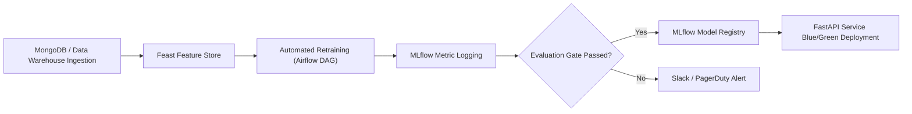
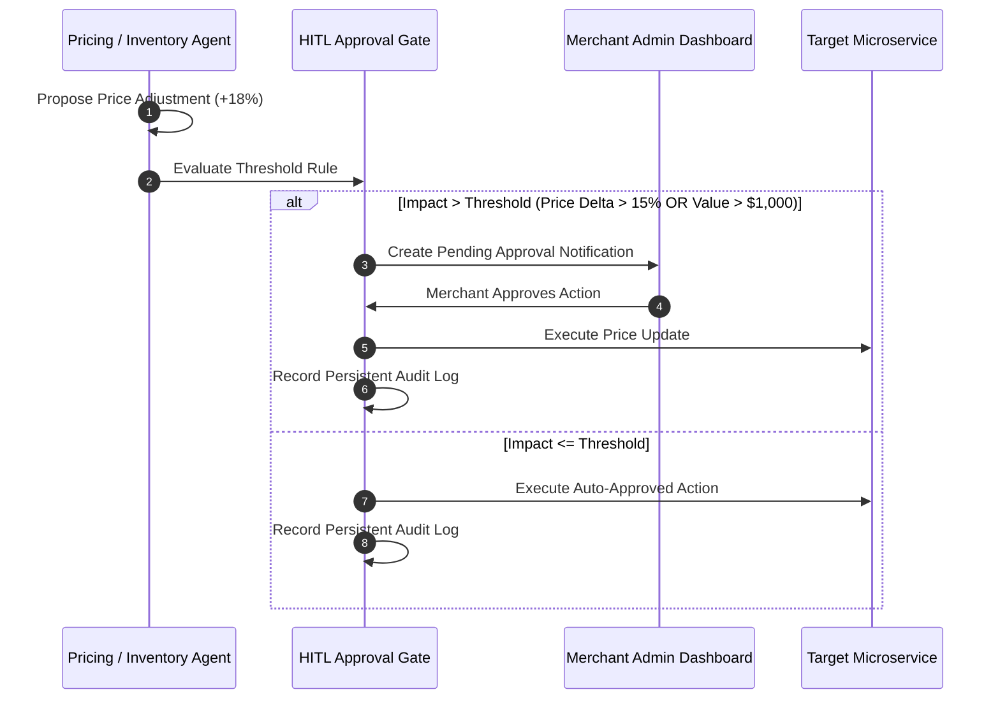
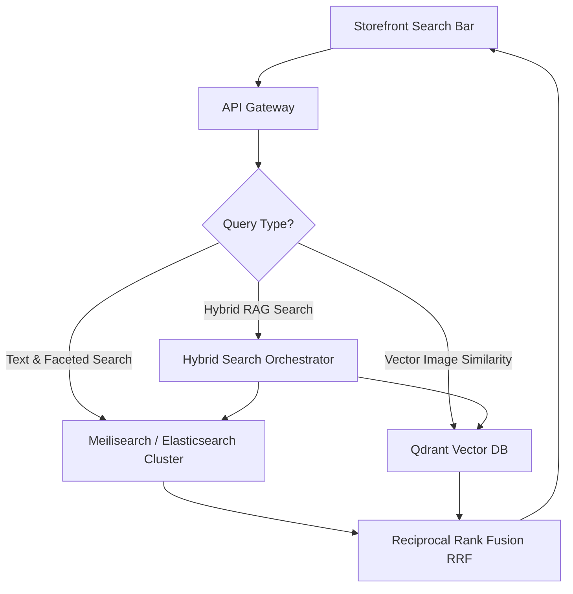

# 🧠 Data & AI Architecture Specification

## Overview
This document standardizes the Vector Database infrastructure, MLOps model lifecycle management, Agentic AI human-in-the-loop guardrails, Redis caching invalidation strategies, and full-text/faceted product search architectures across the **Enterprise AI Commerce Intelligence Platform**.

---

## 1. Unified Vector Database Strategy (Qdrant Standard)

To eliminate architectural drift between `visual-search-service` and `rag-service`:

- **Unified Vector Engine**: **Qdrant** is standardized as the single vector database for all embedding storage and similarity search operations.
- **Collection Topology**:
  - `product_visual_embeddings`: 512-dimensional CLIP image vectors (`visual-search-service`).
  - `knowledge_base_embeddings`: 768-dimensional text vectors generated via `bge-small-en-v1.5` (`rag-service`).
  - `user_behavior_embeddings`: 256-dimensional user preference vectors (`ml-service`).
- **Distance Metric**: **Cosine Similarity** (`Distance.COSINE`) with HNSW index configuration (`m=16`, `ef_construct=100`).

---

## 2. MLOps Lifecycle, Model Versioning, & Evaluation Metrics

All machine learning services (`forecast-service`, `pricing-service`, `fraud-service`, `ml-service`) operate under a structured MLOps framework:

### Model Metric Specifications:
| Microservice | Primary Model Architecture | Retraining Frequency | Evaluation Metric Threshold |
| :--- | :--- | :---: | :--- |
| `forecast-service` | Prophet + LSTM Ensemble | Weekly (Sunday 02:00 UTC) | **MAPE < 8.5%**, RMSE |
| `pricing-service` | Reinforcement Learning (DQN) | Daily (01:00 UTC) | Revenue Lift > +4.2% vs Baseline |
| `fraud-service` | XGBoost Anomaly Classifier | Daily Continuous | **ROC-AUC > 0.96**, Precision@99% |
| `ml-service` | Two-Tower Neural Collaborative Filtering | Bi-Weekly | **NDCG@10 > 0.42**, Recall@20 > 0.65 |

---

## 3. Agentic AI Guardrails & Human-in-the-Loop (HITL) Gates

Autonomous multi-agent workflows executing in `agent-service` (via LangChain & LangGraph) are constrained by strict risk management rules:

### Safety Guardrails:
1. **Price Boundary Lock**: Dynamic pricing agent cannot adjust product prices outside `[Minimum Price Floor, MSRP Ceiling]` boundaries regardless of demand signals.
2. **Bulk Inventory Order Limit**: Inventory replenishment agent cannot issue purchase orders exceeding **$5,000 USD** without merchant manual review.
3. **Immutable Audit Trail**: All agent thoughts, tool invocations, and approved actions are logged to `agent_audit_logs` in MongoDB.

---

## 4. Redis Cache Strategy & Invalidation Patterns

Redis operates as a multi-tier caching layer to reduce MongoDB load and accelerate API response latencies:

| Service | Cache Strategy | Invalidation Trigger | TTL Duration |
| :--- | :--- | :--- | :---: |
| `product-service` | **Cache-Aside** | Product PUT/DELETE mutations | 1 Hour (`3600s`) |
| `cart-service` | **Write-Through** | Cart item addition/removal | 24 Hours (`86400s`) |
| `auth-service` | **Blacklist Set** | User logout / token revocation | Token Expiry (`900s`) |
| `pricing-service` | **Read-Through** | Dynamic price recalculation | 15 Minutes (`900s`) |

---

## 5. Faceted Product Search Architecture (Meilisearch / Elasticsearch + Qdrant)

To support instant, typo-tolerant full-text search with complex multi-attribute filtering (brand, size, price range, color, rating):

- **Lexical Indexing (Meilisearch/Elasticsearch)**: Synchronized via MongoDB Change Streams (CDC) for instant multi-faceted filtering.
- **Hybrid Retrieval**: Combines BM25 lexical keyword scores with Qdrant vector similarity scores via Reciprocal Rank Fusion (RRF).
