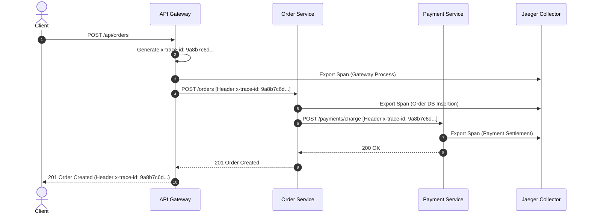

# 📊 Observability, Distributed Tracing, & Monitoring Architecture

## Overview
This document specifies the centralized logging, distributed tracing, metrics collection, and Kubernetes health probe standards implemented across all 19 microservices in the **Enterprise AI Commerce Intelligence Platform**.

---

## 1. Distributed Tracing (OpenTelemetry & Jaeger)

To trace cross-service workflows (such as `Storefront` → `API Gateway` → `Order Service` → `Payment Service` → `Inventory Service`), all microservices propagate W3C Trace Context headers:

- **Trace Header**: `x-trace-id` / `traceparent` (`version-trace_id-parent_span_id-trace_flags`).
- **Span Generation**: Each microservice creates a child span upon receiving an HTTP or Kafka request and injects the `x-trace-id` into downstream HTTP clients (Axios/Fetch) and Kafka message headers.
- **Jaeger Integration**: Spans are exported via OpenTelemetry gRPC exporters to a centralized **Jaeger** collector running on Port `4317`.



---

## 2. Centralized Logging (Loki / ELK Stack)

All microservices emit structured JSON logs to `stdout` / `stderr`, which are ingested by **Grafana Loki** or **Elasticsearch**:

### Standard Log Format (JSON):
```json
{
  "timestamp": "2026-08-11T20:35:00.123Z",
  "level": "INFO",
  "service": "order-service",
  "traceId": "9a8b7c6d-1234-5678-90ab-cdef12345678",
  "spanId": "span-4567",
  "userId": "usr_9988",
  "message": "Order successfully created",
  "meta": {
    "orderId": "ord_5544",
    "totalAmount": 149.99
  }
}
```

---

## 3. Metrics Collection (Prometheus & Grafana)

Each microservice exposes a `/metrics` endpoint scraped by **Prometheus** every 15 seconds:

### Key Metrics Tracked (RED Method):
1. **Rate**: `http_requests_total{service="order-service", method="POST", status="200"}`
2. **Errors**: `http_requests_errors_total{service="payment-service", status="500"}`
3. **Duration**: `http_request_duration_seconds_bucket{le="0.5"}` (P50, P95, P99 Latencies)

---

## 4. Kubernetes Health, Readiness, & Liveness Probes

Every container exposes two distinct health endpoints:

### Liveness Probe (`GET /health/liveness`):
- **Purpose**: Verifies the service container process is running and not deadlocked.
- **K8s Action**: If liveness fails 3 consecutive times, Kubernetes **restarts the container**.

### Readiness Probe (`GET /health/readiness`):
- **Purpose**: Verifies database connections (MongoDB, Redis, Kafka) are active before accepting live traffic.
- **K8s Action**: If readiness fails, Kubernetes **removes the container from LoadBalancer service endpoints**.

```yaml
# Sample Kubernetes Container Probe Manifest
livenessProbe:
  httpGet:
    path: /health/liveness
    port: 3001
  initialDelaySeconds: 10
  periodSeconds: 10

readinessProbe:
  httpGet:
    path: /health/readiness
    port: 3001
  initialDelaySeconds: 15
  periodSeconds: 5
```
