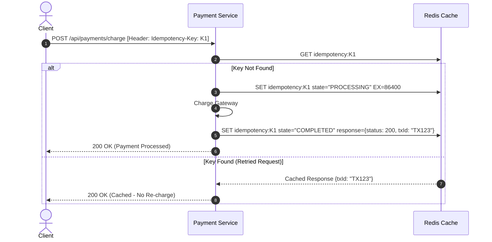
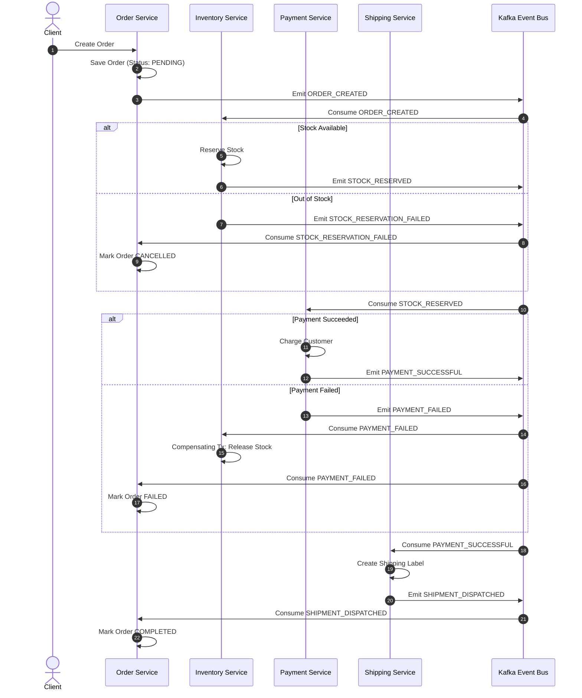

# ⚡ Distributed Systems Resilience & Reliability Architecture

## Overview
This document details the reliability, fault tolerance, idempotency, circuit breaking, and Saga-based distributed transaction patterns implemented across the **Enterprise AI Commerce Intelligence Platform**.

---

## 1. Idempotency Key Strategy (Order & Payment Protection)

To prevent duplicate charges, duplicate order creations, or double inventory reservations during network blips and client retry attempts:

- **`Idempotency-Key` Header**: Clients generate a unique UUID v4 header (`Idempotency-Key: e87c64b2-38d5...`) for all mutating requests (`POST /api/orders`, `POST /api/payments/charge`).
- **Distributed Cache Locking (Redis)**: Microservices check Redis for the key before processing (same Redis instance used by the [Lock-Free Inventory Lua Allocator](../README.md#1-algorithmic-lock-free-in-memory-inventory-allocator-redis-lua-scripts)):
  - **In-Progress Lock**: If a request with the same key is currently processing, concurrent requests receive `409 Conflict`.
  - **Cached Result Return**: If the request previously completed successfully, the stored response (`HTTP 201`) is returned immediately without re-executing logic.

---

## 2. Circuit Breakers, Timeouts, & Cascading Failure Isolation

To prevent a slow AI inference engine (e.g. `agent-service` or `visual-search-service`) from exhausting connection pools and taking down the API Gateway:

- **Request Timeout Limits**:
  - Standard REST microservices: **3.0s Timeout**
  - AI Inference / RAG services: **5.0s Timeout**
- **Circuit Breaker Tiers (Opossum Pattern)**:
  - **Error Threshold**: If 50% of requests fail or timeout within a 10-second window, the circuit **OPENS**.
  - **Fallback Execution**: Subsequent requests immediately return cached fallbacks (e.g. static recommendations or default search results) instead of waiting.
  - **Half-Open Probe**: After a 30-second reset timeout, a probe request tests the health of the downstream AI service.

---

## 3. Distributed Transactions: Saga Pattern (Choreography)

Because microservices have isolated databases (Database-per-Service pattern), cross-service checkout transactions use a **Choreography Saga via Kafka Event Streaming** with automated compensating transactions on failure.

---

## 4. Expanded Event-Driven Architecture (Kafka Integration)

Every major domain event is published to dedicated Kafka topics to ensure eventual consistency:

| Domain Event | Emitting Service | Subscribing Services | Eventual Consistency Action |
| :--- | :--- | :--- | :--- |
| `ORDER_CREATED` | `order-service` | `inventory-service`, `fraud-service`, `data-pipeline` | Reserve stock, score fraud risk, log ETL. |
| `STOCK_RESERVED` | `inventory-service` | `payment-service` | Trigger payment charge workflow. |
| `PAYMENT_SUCCESSFUL` | `payment-service` | `shipping-service`, `order-service` | Generate tracking label, update order state to `PROCESSING`. |
| `PAYMENT_FAILED` | `payment-service` | `inventory-service`, `order-service` | **Compensating Tx**: Release reserved stock, mark order `FAILED`. |
| `SHIPMENT_DISPATCHED` | `shipping-service` | `user-service`, `order-service` | Send customer email notification, mark order `SHIPPED`. |
| `FRAUD_FLAGGED` | `fraud-service` | `order-service`, `payment-service` | Freeze order settlement, require manual merchant review. |
