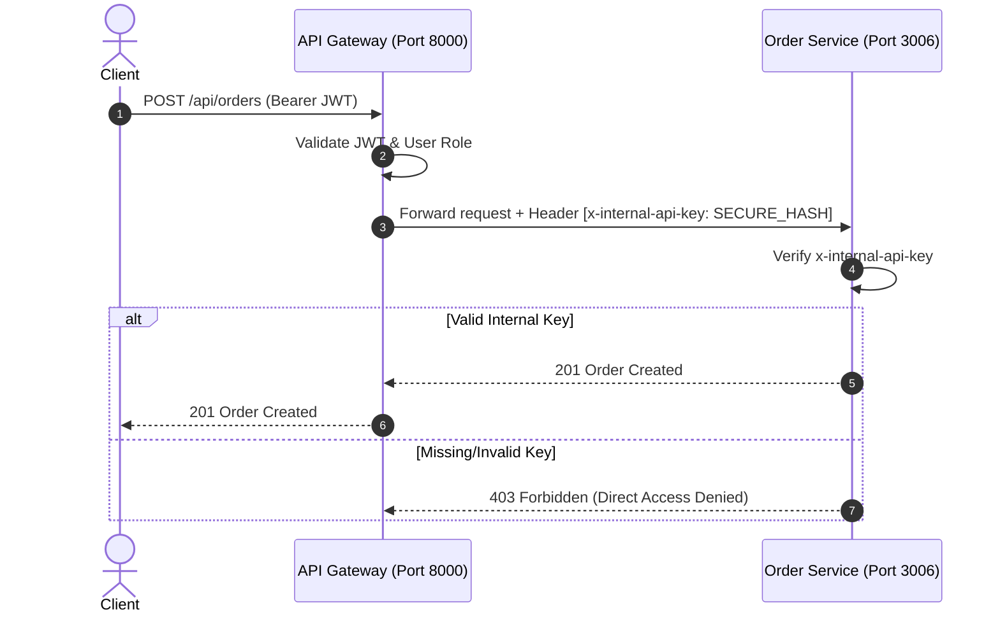

# 🛡️ Enterprise Security & Compliance Architecture

## Overview
This document outlines the security controls, authentication standards, secrets management, input validation, and PCI-DSS compliance frameworks implemented across the **Enterprise AI Commerce Intelligence Platform**.

---

## 1. Service-to-Service Authentication (Zero-Trust Architecture)

To ensure internal microservices cannot be accessed directly if network isolation fails:

- **Internal API Secret Header**: All requests routed through the `api-gateway` append a cryptographically signed internal header `x-internal-api-key`.
- **Internal Validation Middleware**: Microservices (`order-service`, `payment-service`, `inventory-service`, etc.) inspect incoming requests for `x-internal-api-key`. Requests lacking a valid key return `403 Forbidden`.
- **mTLS Service Mesh (Production)**: In Kubernetes deployments, Istio/Linkerd mTLS encrypts inter-service communication and enforces Mutual TLS authorization policies.

---

## 2. Centralized Secrets Management

Environment variables (`.env`) are restricted to local development. In production environments:

- **Secret Store Integration**: Secrets are fetched dynamically from **HashiCorp Vault**, **AWS Secrets Manager**, or **Doppler**.
- **Rotation Policy**: Database credentials and JWT signing keys undergo automated 30-day rotation cycles without service downtime.
- **Zero Hardcoded Credentials**: Source code repositories contain zero plain-text API keys, Stripe secrets, or database passwords.

---

## 3. Refresh Token Rotation & Revocation Strategy

The `auth-service` implements single-use Refresh Token Rotation with automatic revocation:

1. **Refresh Token Pair Generation**: Upon login, a short-lived `accessToken` (15 minutes) and long-lived `refreshToken` (7 days) are issued.
2. **Single-Use Rotation**: When requesting a new access token via `/api/auth/refresh`, the presented `refreshToken` is invalidated, and a fresh pair is generated.
3. **Reuse Detection**: If a previously used `refreshToken` is submitted, the authentication server triggers a security alert, revokes the user's entire active token family, and forces re-authentication.

---

## 4. Tiered Route-Based Rate Limiting

Rate limiting is enforced at the API Gateway with tiered thresholds based on route sensitivity:

| Route Tier | Endpoints | Rate Limit Threshold | Window | Action on Exceeded |
| :--- | :--- | :---: | :---: | :--- |
| **Strict Tier** | `/api/auth/login`, `/api/auth/verify-otp`, `/api/payments/charge` | **5 requests** | 15 Minutes | HTTP 429 & IP Cool-down |
| **Standard Tier** | `/api/cart/*`, `/api/orders/*`, `/api/reviews/*` | **100 requests** | 15 Minutes | HTTP 429 Too Many Requests |
| **Read-Only Tier** | `/api/products/*`, `/api/visual-search/*` | **300 requests** | 15 Minutes | HTTP 429 Too Many Requests |

---

## 5. Input Validation & Request Sanitization Layer

All payload ingest points enforce schema validation to protect against SQL Injection, NoSQL Injection, and Cross-Site Scripting (XSS):

- **Validation Schemas (Joi / Zod)**: Request parameters, headers, and bodies are validated against strict type definitions before controller execution.
- **Sanitization Middleware**: Strips malicious script tags (`DOMPurify`), escapes MongoDB operator characters (`$` and `.`), and enforces strict string length constraints.

---

## 6. PCI-DSS Compliance & Card Data Handling

The platform maintains **PCI-DSS Level 1 Scope Minimization**:

- **Zero PAN/CVV Storage**: Primary Account Numbers (PAN), CVV codes, and expiration dates **never touch or pass through** any internal backend server or database.
- **Client-Side Tokenization**: Credit card data is collected directly by Stripe/PayPal Elements hosted fields on the storefront.
- **Opaque Payment Tokens**: Only non-sensitive payment tokens (`tok_1N3x...`) and transaction IDs are transmitted to `payment-service` for charge settlement.
