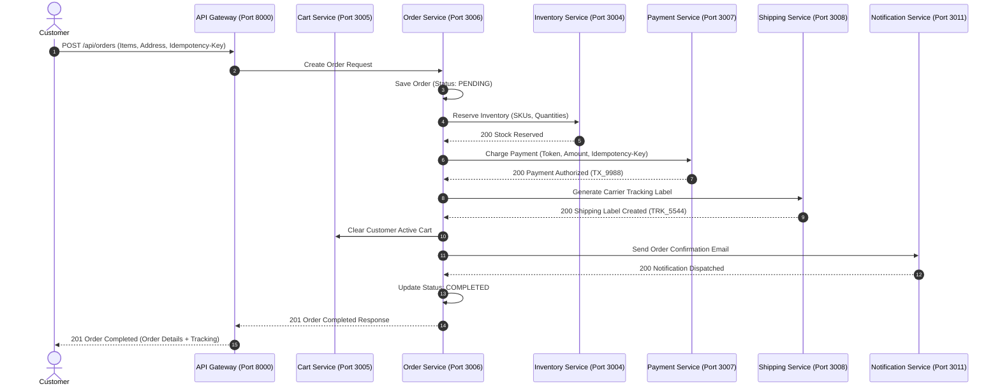
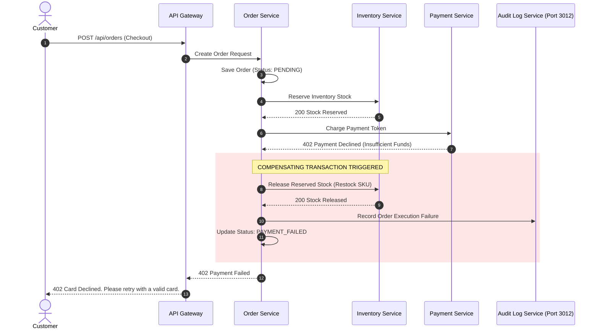
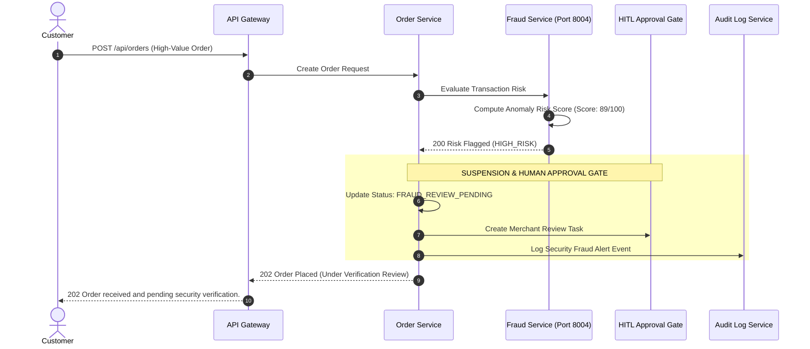

# 🔄 End-to-End Sequence Diagrams & Failure Flows

## Overview
This document specifies the end-to-end execution flows and failure compensation paths for critical commerce workflows across the **Enterprise AI Commerce Intelligence Platform**.

---

## 1. Successful E-Commerce Checkout Sequence

---

## 2. Payment Failure & Compensating Refund Sequence

---

## 3. Fraud-Flagged Order Suspension Sequence

