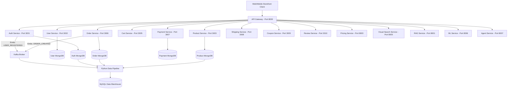

# System Design Specification

# Enterprise AI Commerce Intelligence Platform

---

## 1. Microservices Breakdown & Port Allocation

Here is the exact mapping for all deployed microservices in the platform:

| Service Category | Service Name | Protocol | Port | Primary Responsibility |
| :--- | :--- | :---: | :---: | :--- |
| **Gateway** | `api-gateway` | HTTP/REST | `8000` | Single entry point for clients. Routes requests & validates tokens. |
| **Core Domain (10)** | `auth-service` | HTTP/REST | `3001` | JWT, Google OAuth2, Speakeasy TOTP MFA, Kafka events. |
| | `user-service` | HTTP/REST | `3002` | User profiles, addresses, role management. |
| | `product-service` | HTTP/REST | `3003` | Product catalog CRUD, multi-attribute search. |
| | `inventory-service` | HTTP/REST | `3004` | Stock levels, checkout reservations, release logic. |
| | `cart-service` | HTTP/REST | `3005` | User cart persistence & guest cart merging. |
| | `order-service` | HTTP/REST | `3006` | Order processing pipeline & status workflow. |
| | `payment-service` | HTTP/REST | `3007` | Payment transactions, mock gateway, refunds. |
| | `shipping-service` | HTTP/REST | `3008` | Carrier selection, rate calculation, tracking. |
| | `coupon-service` | HTTP/REST | `3009` | Promotional discounts, coupon validation. |
| | `review-service` | HTTP/REST | `3010` | Product ratings, customer reviews, helpfulness votes. |
| **Intelligence (7)** | `rag-service` | HTTP/REST | `8001` | Vector search QA, FAQ assistance, review summary. |
| | `forecast-service` | HTTP/REST | `8002` | Time-series demand forecasting (Prophet/LSTM). |
| | `pricing-service` | HTTP/REST | `8003` | Dynamic price optimization based on demand/stock. |
| | `fraud-service` | HTTP/REST | `8004` | Transaction risk scoring & anomaly detection. |
| | `visual-search-service` | HTTP/REST | `8005` | Image similarity search using CLIP embeddings. |
| | `ml-service` | HTTP/REST | `8006` | Collaborative & content recommendation models. |
| | `agent-service` | HTTP/REST | `8007` | LangChain / LangGraph multi-agent orchestration. |

---

## 2. High-Level Communication Flow

