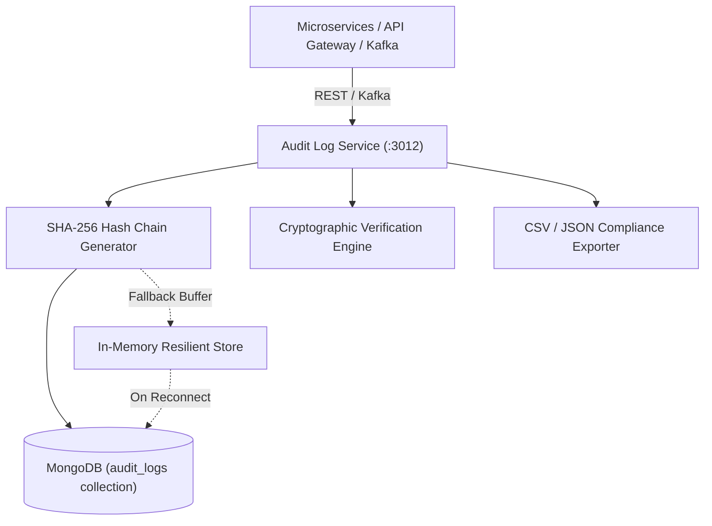

# 🛡️ Audit Log Service (Microservice)

An enterprise-grade, immutable audit log microservice engineered for high-throughput distributed transaction tracing, compliance auditing (SOC-2, PCI-DSS, GDPR, HIPAA), operational monitoring, and security incident response.

---

## 🌟 Key Architectural Features

1. **Tamper-Evident SHA-256 Cryptographic Hash Chaining**:
   - Every audit record contains the SHA-256 hash of the immediately preceding record (`previousHash`).
   - The current entry's payload is deterministically serialized and hashed (`hash`), creating an unbroken chain of custody.
   - Any retro-active modification, deletion, or insertion instantly invalidates the chain upon verification.
2. **Dual Ingestion (REST API & Distributed Kafka Streaming)**:
   - Synchronous REST endpoints (`POST /api/audit-logs`, `POST /api/audit-logs/batch`).
   - Asynchronous real-time message consumption from Kafka topics (`audit-logs`, `audit-events`).
3. **Resilient In-Memory Fallback & Auto-Sync**:
   - Zero-drop architecture: If MongoDB is transiently unreachable, logs are cryptographically chained and buffered in memory.
   - Once MongoDB reconnects, in-memory buffered records are automatically synced and persisted.
4. **Rich Multi-Dimensional Query Engine**:
   - Filtering by `actorId`, `actorType`, `action`, `category`, `severity`, `status`, `resourceType`, `resourceId`, `correlationId`, `date range` (`startDate`, `endDate`), and full-text `search`.
   - Cursor-like and offset-based pagination with total record count and sequence numbers.
5. **Real-Time Security & Compliance Alerts**:
   - Automatically flags `CRITICAL` and `HIGH` severity actions (e.g. privilege escalation, unauthorized data access, failed security challenges).
6. **Regulatory Compliance Export**:
   - Direct streaming export to **CSV** or **JSON** for external auditing, legal compliance, and long-term cold storage.

---

## 🏗️ Architecture & Data Model



### Audit Log Schema Structure

| Field | Type | Description |
| :--- | :--- | :--- |
| `logId` | `String` | Unique audit log identifier (e.g. `audit_1715000000_a1b2c3d`) |
| `sequenceNumber` | `Number` | Monotonically increasing sequential index |
| `actor` | `Object` | `{ id, type, email, ipAddress, userAgent }` |
| `action` | `String` | Normalized action string (e.g. `ORDER_CREATED`, `USER_ROLE_UPDATED`) |
| `category` | `Enum` | `AUTH`, `ORDER`, `PAYMENT`, `INVENTORY`, `PRICING`, `USER`, `SYSTEM`, `SECURITY`, `COMPLIANCE`, `AI_AGENT`, `OTHER` |
| `severity` | `Enum` | `INFO`, `LOW`, `MEDIUM`, `HIGH`, `CRITICAL` |
| `targetResource` | `Object` | `{ resourceType, resourceId }` (e.g. `PRODUCT:prod_123`) |
| `details` | `Object` | `{ before, after, diff, metadata }` |
| `status` | `Enum` | `SUCCESS`, `FAILURE`, `ATTEMPTED`, `BLOCKED` |
| `correlationId` | `String` | Distributed tracing correlation ID |
| `clientInfo` | `Object` | `{ origin, serviceName }` |
| `hash` | `String` | SHA-256 hash of this entry combined with `previousHash` |
| `previousHash` | `String` | SHA-256 hash of the previous sequential log entry |
| `timestamp` | `Date` | UTC timestamp of the audited event |

---

## 🚀 API Reference

Base Path: `/api/audit-logs`

### 1. Ingest Single Audit Log
- **Endpoint**: `POST /api/audit-logs`
- **Body**:
  ```json
  {
    "actor": {
      "id": "usr_9981",
      "type": "ADMIN",
      "email": "admin@enterprise.internal",
      "ipAddress": "192.168.1.50"
    },
    "action": "PRICE_OVERRIDE",
    "category": "PRICING",
    "severity": "HIGH",
    "targetResource": {
      "resourceType": "PRODUCT",
      "resourceId": "prod_4581"
    },
    "details": {
      "before": { "price": 199.99 },
      "after": { "price": 149.99 },
      "metadata": { "reason": "Flash Sale Approval" }
    },
    "status": "SUCCESS"
  }
  ```
- **Response** `201 Created`:
  ```json
  {
    "success": true,
    "data": {
      "logId": "audit_1715000000_x9z2p",
      "sequenceNumber": 142,
      "hash": "e3b0c44298fc1c149afbf4c8996fb92427ae41e4649b934ca495991b7852b855",
      "previousHash": "a1b2c3d4...",
      "timestamp": "2026-08-14T08:15:00.000Z"
    }
  }
  ```

### 2. Ingest Batch Audit Logs
- **Endpoint**: `POST /api/audit-logs/batch`
- **Body**:
  ```json
  {
    "logs": [
      { "action": "INVENTORY_DEDUCTED", "category": "INVENTORY", "targetResource": { "resourceType": "SKU", "resourceId": "SKU-99" } },
      { "action": "PAYMENT_CAPTURED", "category": "PAYMENT", "targetResource": { "resourceType": "ORDER", "resourceId": "ord_881" } }
    ]
  }
  ```

### 3. Query & Filter Audit Logs
- **Endpoint**: `GET /api/audit-logs`
- **Query Parameters**:
  - `page` (default: `1`), `limit` (default: `20`, max: `100`)
  - `category`, `action`, `severity`, `status`
  - `actorId`, `actorType`, `resourceType`, `resourceId`, `correlationId`
  - `startDate`, `endDate` (ISO 8601 strings)
  - `search` (searches action, actor, targetResource, and metadata)
  - `sortBy` (default: `timestamp`), `sortOrder` (`asc` / `desc`)

### 4. Cryptographic Hash Chain Verification
- **Endpoint**: `GET /api/audit-logs/verify-chain`
- **Query Parameters**:
  - `limit` (optional): Verify the last N records (or full chain if omitted).
- **Response** `200 OK`:
  ```json
  {
    "success": true,
    "data": {
      "isValid": true,
      "count": 142,
      "corruptedLogId": null,
      "message": "All 142 audit logs cryptographically verified. Hash chain is unbroken and intact."
    }
  }
  ```

### 5. Aggregate Analytics & Compliance Stats
- **Endpoint**: `GET /api/audit-logs/stats`
- **Query Parameters**: `startDate`, `endDate`
- **Returns**: Breakdown by category, severity, status, top actors, and high-risk security alerts.

### 6. Export Compliance Logs
- **Endpoint**: `GET /api/audit-logs/export`
- **Query Parameters**: `format=csv` or `format=json`, plus any filter parameters.

---

## ⚙️ Environment Configuration

| Variable | Default | Description |
| :--- | :--- | :--- |
| `PORT` | `3012` | HTTP Server port |
| `NODE_ENV` | `development` | Runtime environment (`development` / `production` / `test`) |
| `MONGO_URI` | `mongodb://localhost:27017/ecommerce-audit-logs` | MongoDB connection string |
| `KAFKA_BROKERS` | `localhost:9092` | Comma-separated Kafka broker list |
| `KAFKA_CLIENT_ID` | `audit-log-service` | Kafka Client identifier |
| `KAFKA_GROUP_ID` | `audit-log-group` | Kafka Consumer Group ID |
| `KAFKA_TOPIC` | `audit-logs` | Target Kafka topic for audit streaming |

---

## 🐳 Docker Deployment

```bash
docker build -t audit-log-service:latest .
docker run -p 3012:3012 --env-file .env audit-log-service:latest
```
