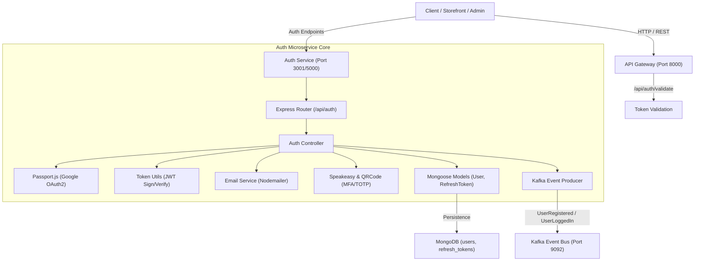

# 🔐 Auth Service — Architecture & Design Blueprint

The **Auth Service** is the central authentication and identity microservice for the Enterprise AI-Commerce Intelligence Platform. Built with Node.js, Express, MongoDB, Passport.js, and Kafka, it provides JWT token management, Multi-Factor Authentication (MFA), OAuth2 social login, and inter-service token validation.

---

## 🏗️ Architecture & Internal Design



---

## 📂 Internal Directory Structure

```text
auth-service/
├── .env                  # Environment configuration
├── package.json          # Node dependencies & npm scripts
├── Readme.md             # Architecture & operational documentation
└── src/
    ├── index.js          # Express app entrypoint & database connection
    ├── config/
    │   ├── db.js         # MongoDB Mongoose connection handler
    │   └── passport.js   # Google OAuth2 strategy configuration
    ├── controllers/
    │   └── auth.controller.js # Request handlers for all auth flows
    ├── events/
    │   └── kafka.js      # Event streaming producer & offline fallback
    ├── middleware/
    │   └── auth.middleware.js # JWT Bearer validation middleware
    ├── models/
    │   ├── User.js       # User schema (roles, MFA secrets, OAuth IDs)
    │   └── RefreshToken.js # Refresh token schema with revocation tracking
    ├── routes/
    │   └── auth.routes.js # Express router definitions with input validators
    └── utils/
        ├── tokenUtils.js   # JWT access/refresh token generator & verifier
        └── emailService.js # SMTP reset password email dispatcher
```

---

## 🚀 Key Internal Capabilities

### 1. Traditional Authentication
- **Registration**: Bcrypt password hashing (salt factor 10), automatic account creation, Kafka `UserRegistered` event emitting.
- **Login**: Credential verification, soft Google OAuth detection, MFA enforcement check, access/refresh token generation.
- **Token Refresh**: Token rotation pattern—old refresh tokens are invalidated upon use and replaced with a fresh token pair.
- **Logout**: Refresh token revocation in MongoDB and Kafka `UserLoggedOut` event emission.

### 2. Multi-Factor Authentication (MFA / TOTP)
- Powered by **Speakeasy** & **QRCode**.
- Secret generation with base32 encoding and QR code rendering for Google Authenticator / Authy.
- Time-based OTP verification with clock drift tolerance during login.

### 3. Google OAuth2 Social Login
- Configured via **Passport.js** with `passport-google-oauth20`.
- Automatic user provisioning or account linking based on verified email address.
- Redirect flow returning JWT tokens upon successful authorization.

### 4. API Gateway Token Validation
- `/api/auth/validate` endpoint allows the API Gateway to verify incoming JWT access tokens without sharing secret keys across microservice boundaries.

---

## 📡 API Endpoint Reference

| Method | Endpoint | Access | Description |
| :--- | :--- | :--- | :--- |
| `POST` | `/api/auth/register` | Public | Register new user account |
| `POST` | `/api/auth/login` | Public | Authenticate user & receive token pair |
| `POST` | `/api/auth/refresh-token` | Public | Exchange refresh token for new access token |
| `POST` | `/api/auth/logout` | Authenticated | Revoke refresh token and log out |
| `POST` | `/api/auth/forgot-password` | Public | Request password reset token via email |
| `POST` | `/api/auth/reset-password` | Public | Reset password with valid reset token |
| `GET` | `/api/auth/google` | Public | Trigger Google OAuth2 authentication |
| `GET` | `/api/auth/google/callback` | Public | Google OAuth2 redirect callback |
| `POST` | `/api/auth/mfa/setup` | Authenticated | Generate TOTP secret & QR Code |
| `POST` | `/api/auth/mfa/verify-enable` | Authenticated | Verify OTP code and enable MFA |
| `POST` | `/api/auth/mfa/verify-login` | Public | Step 2 MFA login verification |
| `POST` | `/api/auth/mfa/disable` | Authenticated | Disable MFA for user |
| `POST` | `/api/auth/validate` | Internal | Validate JWT access token (for API Gateway) |

---

## ⚙️ Environment Variables (`.env`)

```env
PORT=3001
NODE_ENV=development
MONGO_URI=mongodb://localhost:27017/ecommerce-auth
JWT_SECRET=your-super-secret-jwt-key
JWT_EXPIRES_IN=15m
REFRESH_TOKEN_SECRET=your-super-secret-refresh-key
REFRESH_TOKEN_EXPIRES_IN=7d

# Google OAuth2
GOOGLE_CLIENT_ID=your-google-client-id
GOOGLE_CLIENT_SECRET=your-google-client-secret
GOOGLE_CALLBACK_URL=http://localhost:3001/api/auth/google/callback

# Event Bus
KAFKA_BROKER=localhost:9092

# Client URL
CLIENT_URL=http://localhost:3000
```
