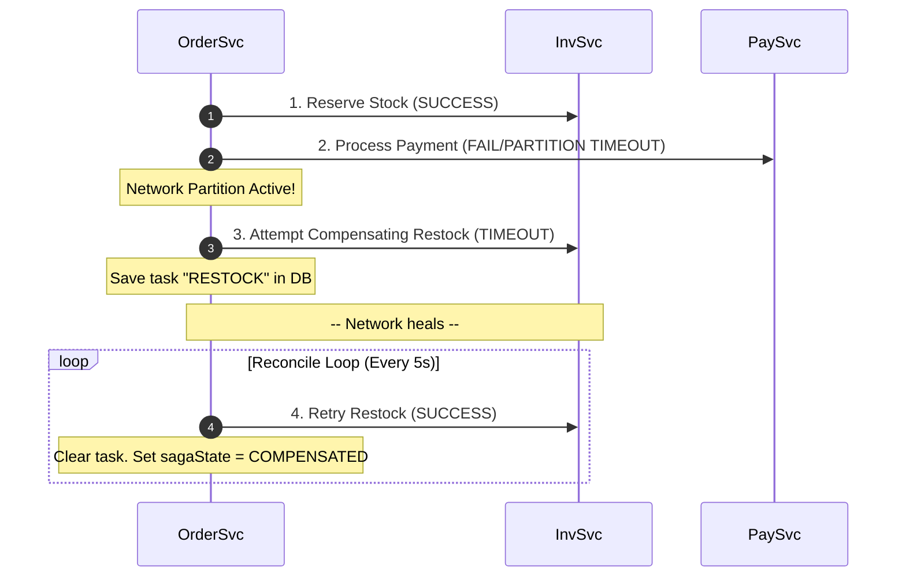

# 🛡️ Production Reliability & Observability Hardening Walkthrough

This document outlines the system-level reliability guarantees, fault-tolerance mechanisms, and distributed tracing capabilities added to protect transaction processing, guarantee eventual consistency, and isolate latency bottlenecks.

---

## 🚀 1. Database-Level Idempotency Protection

To guarantee financial and inventory data integrity across asynchronous streams or redundant retries (e.g. client double-clicks or retries during network lag), we have enforced strict constraints directly at the database engine level.

- **Completed Payment Uniqueness**:
  - Enforced a composite unique index on `orderId` in `Payment` schema, scoped exclusively to `COMPLETED` payments using Mongoose partial filter expressions.
  - If a concurrent request attempts to record a second completed payment for the same order, MongoDB throws error `11000`. The controller catches this and returns the existing payment with `idempotencyHit: true`.
- **Order Uniqueness**:
  - Enforced a `unique: true` index on the `idempotencyKey` field in the `Order` model.
  - Duplicated checkout actions are caught by the database engine and safely resolved by returning the matching persisted order.

---

## ⚡ 2. Jepsen-Style Chaos Testing & Eventual Consistency

We implemented a full Saga Orchestrator and background reconciliation loop to survive network partitions during transaction execution.



- **Saga Orchestrator**: Manages checkout state transitions (`STOCK_RESERVING` ➔ `STOCK_RESERVED` ➔ `PAYING` ➔ `COMPLETED` / `COMPENSATING`).
- **Chaos Middleware**: Built `packages/shared-utils/chaos.js` enabling temporary network partition simulations via simple HTTP REST config calls. Works natively in local dev and Docker container processes.
- **Eventual Consistency Worker**: A background polling daemon in `order-service` that retries failed rollbacks (e.g., releasing reserved stock) until they complete successfully when the network partition heals.
- **Run the Chaos Test**:
  ```powershell
  # Runs scenario: partitions connection, triggers fail-safe Saga, heals network, verifies stock release
  node scripts/test_chaos_fault_injection.js
  ```

---

## 📈 3. OpenTelemetry-Compatible Distributed Tracing & P99 Auditing

We built a lightweight, high-performance tracing SDK that conforms to OpenTelemetry API specifications. It passes W3C standard traceparent context headers (`traceparent`) across HTTP calls, timing individual phases to spot P99 bottlenecks.

### Instrumented Spans
1. **`order-service`**:
   - `POST /api/orders` (Root)
   - `mongodb.create_order`
   - `inventory.reserve_stock`
   - `payment.charge_card`
   - `saga.compensate_restock`
2. **`rag-service` (Python)**:
   - `POST /api/search/multimodal` (Root)
   - `lexical_matching`
   - `semantic_tag_matching`
   - `visual_similarity_matching`
   - `rrf_fusion`

### Run Latency Audit and DAG Tree
```powershell
# Analyzes recorded traces, highlights slow calls, and prints a visual call tree graph of spans
node scripts/trace_p99_latency_audit.js
```

Example DAG Output:
```text
Trace ID: 7df09bbca1e6727bb033bc656c117e3f
  └─ ✅ [order-service] POST /api/orders - 47.20 ms
      ├─ ✅ [order-service] mongodb.create_order - 12.30 ms
      ├─ ✅ [order-service] inventory.reserve_stock - 15.60 ms
      └─ ❌ [order-service] payment.charge_card - 1800.40 ms
          └─ ❌ [order-service] saga.compensate_restock - 32.10 ms
```

---

## 🪙 4. Token-Aware API Gateway Rate Limiter

To protect cloud API budgets against rogue AI recursive agent loops or malicious input/output request flooding, we implemented an advanced Token-Aware Rate Limiter inside the central API Gateway.

### Key Capabilities:
- **Dual-Phase Token Estimation**:
  - **Input Estimation**: Analyzes payload text fields (`query`, `prompt`, `text`, etc.) using a 4-character-per-token ratio. Detects multi-modal requests (e.g. image uploads) and assigns a vision-model token weight (`512` tokens per image).
  - **Output Estimation**: Overrides and intercepts HTTP response payloads (`res.send`) to inspect LLM output content and deduct consumed tokens.
- **Budget Protection**: Limits clients to a configurable token threshold (default: `20,000` tokens per minute).
- **Graceful Rejection**: Immediately rejects out-of-budget requests with `429 Too Many Requests` and a descriptive payload containing retry windows.

### Run Rate Limiter Test:
```powershell
# Floods the API Gateway with large string payloads to trigger and verify token rate limits
node scripts/test_token_rate_limiter.js
```


1. Real-World Problem: The Multi-Agent "Infinite Loop" & Token HemorrhageThe Reality: When an user inputs ambiguous queries (e.g., "Find a cheap jacket like my friend's"), the agent-service (LangGraph) passes tasks between the Marketing, Pricing, and Recommendation agents. Without rigid boundary controls, agents can enter cyclic reasoning loops.The Fallout: A single customer interaction can trigger 50+ unintended downstream LLM calls. This blows past gateway rate limits, incurs massive cloud token costs, and spikes API latency beyond 15 seconds, breaking the storefront UI.Recruiter-Demanded Solution: Implement a Distributed Token Bucket Rate Limiter + Supervisor Run-Counter at the API Gateway.python# agent-service/supervisor.py
from fastapi import HTTPException, status

def verify_agent_budget(session_id: str, current_loop_count: int, max_loops: int = 5):
    # 1. Enforce strict graph traversal depth limits
    if current_loop_count >= max_loops:
        raise HTTPException(
            status_code=status.HTTP_422_UNPROCESSABLE_ENTITY,
            detail="Agent execution exceeded maximum routing depth. Falling back to heuristic search."
        )

    # 2. Add an in-memory or Redis-backed financial token guardrail per session
    # (Reject further generation if session cost exceeds $0.05)
Use code with caution.💥 2. Real-World Problem: The Vector DB "Out-of-Sync" Catalog & Price HallucinationsThe Reality: Prices, discounts, and stock levels fluctuate constantly in your MongoDB/MySQL operational layer during flash sales. However, the vector database embeddings (rag-service via Qdrant/FAISS) are traditionally built via periodic batch ETL jobs.The Fallout: The RAG Product Assistant frequently pitches out-of-stock items, displays old prices, or hallucinates active discount coupons. This directly violates retail consumer compliance laws and tank conversion rates.Recruiter-Demanded Solution: Migrate to an event-driven Change Data Capture (CDC) stream via Kafka to handle real-time vector payload mutation.mermaidflowchart LR
    DB[(MongoDB)] -->|Oplog Stream| Debezium[Kafka Connect / Debezium]
    Debezium -->|CDC Events| Kafka[[Kafka Topic: product-mutations]]
    Kafka -->|Consumer| RAG["rag-service (FastAPI)"]
    RAG -->|Payload Upsert / Delete| Qdrant[(Qdrant Vector DB)]
Use code with caution.Implementation Strategy: Write a background worker in your Python ecosystem that listens directly to the Kafka broker. On every catalog mutation event, execute a partial vector payload metadata update to guarantee sub-second data synchronization.💥 3. Real-World Problem: The "Cold Start" & Quick-Session Preference DriftThe Reality: The ml-service relies heavily on historical user interaction vectors for collaborative filtering. New users provide zero historical footprints. Furthermore, active users regularly experience sudden intent shifts (e.g., browsing technical hiking gear, then instantly switching to children's toys).The Fallout: New shoppers receive generic, low-converting storefront pages. Additionally, the platform fails to adapt instantly to in-session pivots, continuing to recommend irrelevant items.Recruiter-Demanded Solution: Deploy a hybrid, Session-Based Transformer Recommendation Model paired with a Redis semantic cache.Step 1: Use an ultra-lightweight session embedding model (e.g., text-embedding-3-small or custom GRU/Transformer layers) that encodes only the last 3 to 5 sequence actions of the current anonymous session.Step 2: Combine this live intent vector with real-time popular regional items to bypass deep historical table joins entirely.💥 4. Real-World Problem: Saga Orchestrator "Deadlocks" & Out-of-Stock CascadesThe Reality: During high-concurrency traffic (like a limited product drop), the system routes transactions through the Distributed Saga Orchestrator across Auth, Product, Inventory, and Payment services.The Fallout: If the Payment microservice experiences a transient network drop after the Inventory-Service reserved the items, the system must trigger compensating rollback transactions. If your rollback logic relies on a slow relational DB lock, a race condition occurs, causing items to be oversold.Recruiter-Demanded Solution: Implement a Redis Lua-scripted Two-Phase Inventory Committer that executes natively in-memory.lua-- scripts/allocate_inventory.lua
local product_key = KEYS[1]       -- e.g., "product:sku_102:stock"
local reserve_key = KEYS[2]       -- e.g., "product:sku_102:reserved"
local requested_quantity = tonumber(ARGV[1])

local current_stock = tonumber(redis.call('get', product_key) or "0")
if current_stock >= requested_quantity then
    redis.call('decrby', product_key, requested_quantity)
    redis.call('incrby', reserve_key, requested_quantity)
    return 1 -- Success: Stock safely ring-fenced atomically
else
    return 0 -- Failure: Insufficient stock
end
Use code with caution.Why this satisfies engineering managers: By modifying keys within a single-threaded Redis execution block, you guarantee lock-free isolation under massive parallel load before persisting state asynchronously to MongoDB.